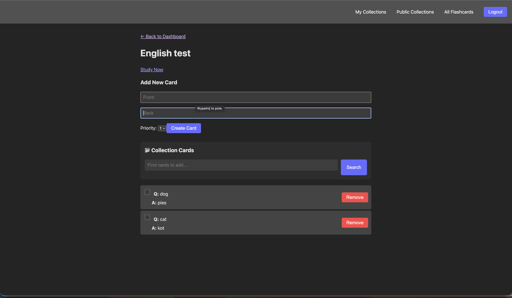
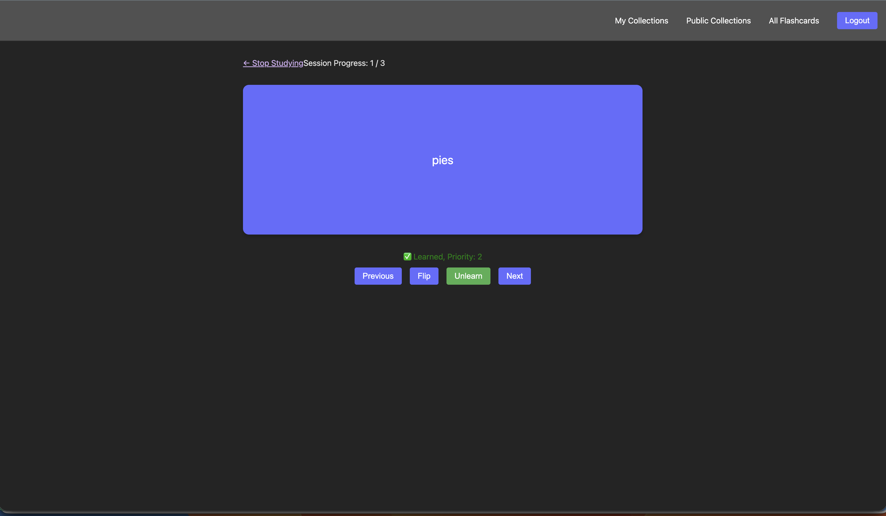
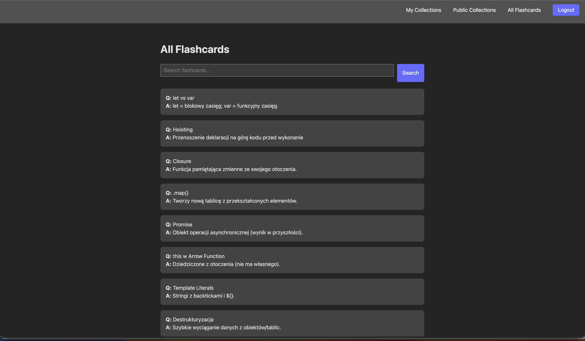
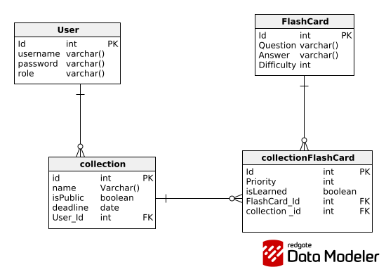

# myQuiz 🧠

> A modern, intelligent flashcard application built for efficient learning.

myQuiz is a full-stack web application designed to help you master new subjects through customizable flashcard collections. Whether you're learning a new language or preparing for an exam, myQuiz offers a smart study environment with progress tracking and prioritization.

## ✨ Key Features

- **📂 Collection Management**: Create, edit, and organize your flashcards into custom collections.
- **⚡ Smart Study Mode**: A dedicated study interface that prioritizes cards based on your needs (see "Under the Hood").
- **🌍 Public & Private Access**: Keep your collections private or explore public collections shared by others.
- **🔍 Global Search**: Find existing flashcards from the global database and add them to your own collections.
- **✅ Progress Tracking**: Mark cards as "Learned" effectively removing them from the immediate study queue.
- **🚀 Priority System**: Assign priority levels (1-5) to specific cards to control how often they appear during study sessions.

---

## App Preview







---

## 🛠️ Tech Stack

This project is built with the **latest** web technologies to ensure performance and developer experience.

### Frontend (Client)
- **React 19**: Utilizing the newest features of the React ecosystem.
- **Vite 7**: Blazing fast build tool and development server.
- **React Router 7**: Modern routing for seamless navigation.
- **Axios**: Robust HTTP client for API interactions.
- **CSS3**: Custom, responsive styling without heavy framework bloat.

### Backend (Server)
- **Node.js & Express 5**: Using the next-generation version of Express for improved routing and error handling.
- **Prisma ORM**: Type-safe database access for intuitive data modeling.
- **SQLite**: Lightweight, serverless database engine for easy deployment and portability.
- **JWT (JSON Web Tokens)**: Secure, stateless authentication middleware.

---

##  ⚙️ Under the Hood: What makes it cool?

The most interesting part of `myQuiz` is the **Study Session Algorithm** located in `CardView.jsx`. It's not just a random shuffler; it's designed to reinforce difficult concepts.

### 1. Weighted Priority Queue
When you start a study session, the app doesn't just grab your cards. It builds a **weighted queue** based on the priority you assigned (1-5):
- A card with **Priority 1** is added to the pool once.
- A card with **Priority 5** is added **five times**.
This means difficult or high-importance cards appear more frequently within a single session, reinforcing the memory trace through repetition.

### 2. Intelligent Filtering
The algorithm automatically filters out cards you have already marked as `isLearned`. This ensures your study time is efficient, focusing strictly on active recall of unknown material.

### 3. Fisher-Yates Shuffle
Once the weighted pool is generated, a custom implementation of the Fisher-Yates shuffle ensures a truly random distribution of the cards, preventing any predictable patterns during your study session.

---

## 📊 Data Model

Here is the database schema used in the application:




---

## �🚀 Getting Started

Follow these steps to set up the project locally.

### Prerequisites
- Node.js (v18+ recommended)
- npm

### 1. Clone & Install
```bash
git clone <repository_url>
cd myQuiz
```

### 2. Setup Server & Client
```bash
docker compose up -d
```


Open your browser and navigate to the http://localhost:5173

---

## 🏗️ Project Structure

```
myQuiz/
├── client/                 # React 19 frontend
│   ├── src/
│   │   ├── components/     # Reusable UI components
│   │   ├── pages/          # Full page views (CardView, Dashboard, etc.)
│   │   ├── services/       # API communication (Axios)
│   │   └── context/        # Global state (Auth)
│   └── package.json
│
├── server/                 # Express 5 backend
│   ├── api/                # Route controllers
│   ├── prisma/             # Database schema (schema.prisma)
│   ├── middleware/         # Auth & error handling
│   ├── app.js              # Entry point
│   └── database.sqlite     # Local DB file
│
└── README.md
```

---

*Built with ❤️ for better learning.*
